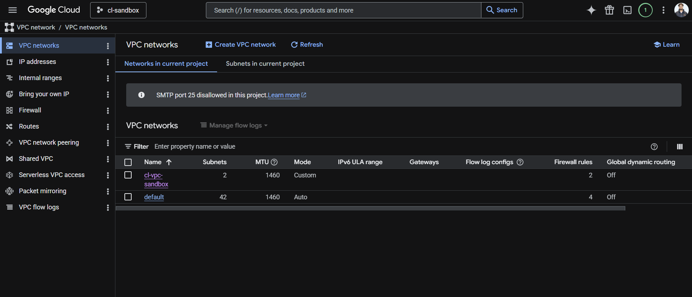
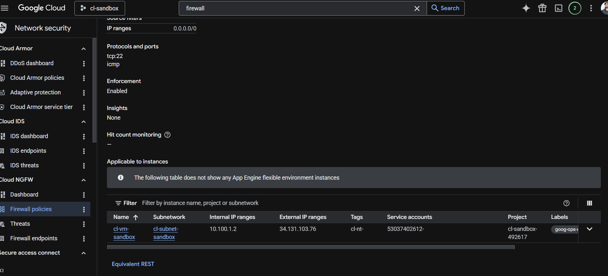
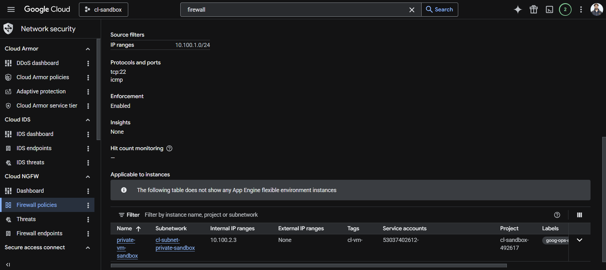
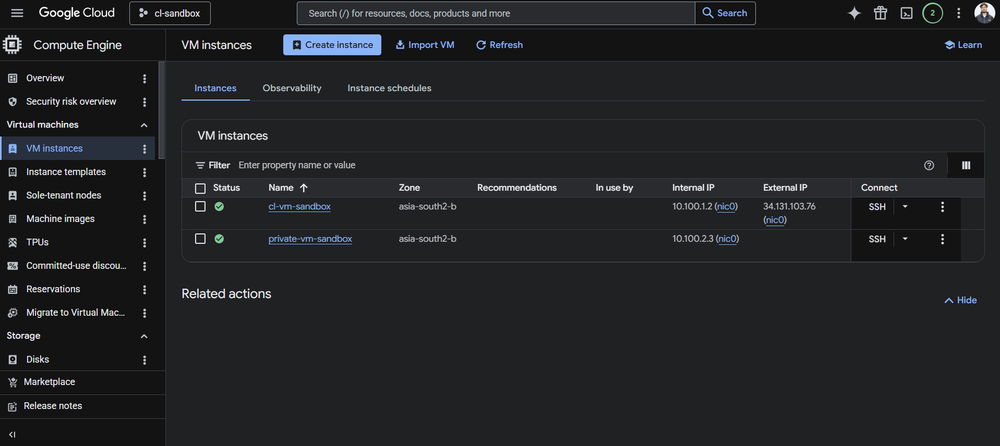
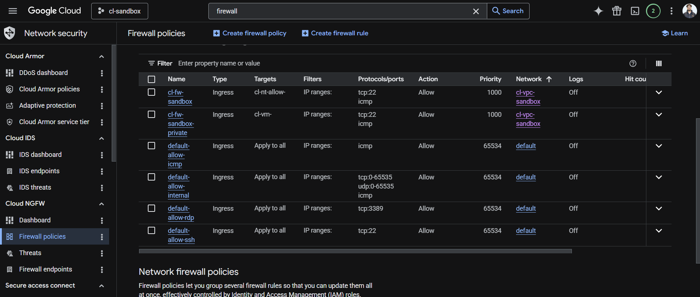
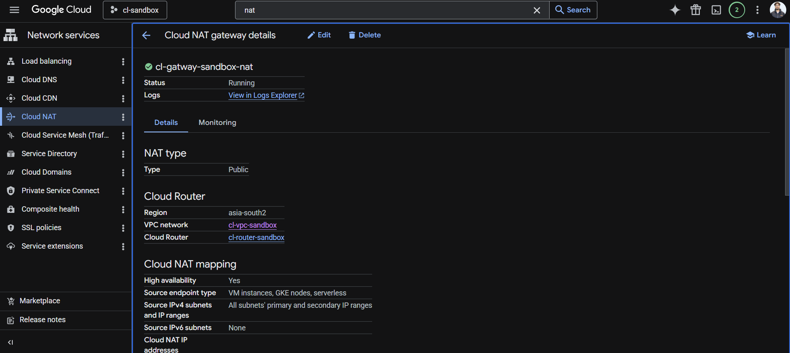
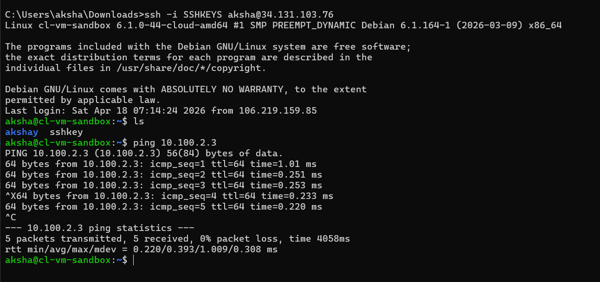
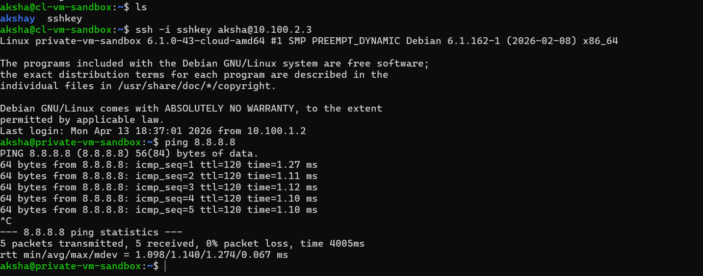
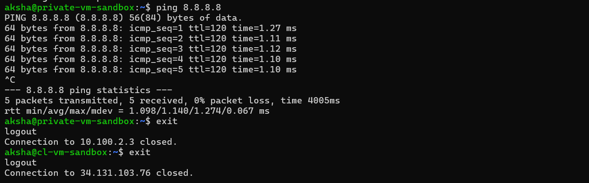

# 🔐 Secure VPC Architecture with NAT (GCP)

## 📌 Overview

Designed and implemented a secure Virtual Private Cloud (VPC) in Google Cloud with segmented subnets, controlled access policies, and private instance internet access using Cloud NAT.

---

## 🧱 Architecture

* Custom VPC: `cl-vpc-sandbox`
* Public Subnet: `10.100.1.0/24`
* Private Subnet: `10.100.2.0/24`
* Public VM (external IP enabled)
* Private VM (no external IP)

---

## 🔐 Security Controls

* Configured firewall rules for:

  * SSH access (TCP 22)
  * ICMP for internal communication
* Implemented subnet-based access control
* Enforced network segmentation between public and private resources

---

## 🌐 Cloud NAT Implementation

* Deployed Cloud NAT for private subnet
* Enabled outbound internet access for private VM without exposing it publicly
* Verified NAT functionality using external connectivity tests

---

## 🧪 Validation & Testing

### ✅ Internal Communication

* Verified ICMP (ping) between VMs within VPC

### ✅ SSH Access

* Successfully connected to instances using SSH

### ✅ Private VM Internet Access

* Verified outbound connectivity using:

  ```
  ping 8.8.8.8
  ```

---

## 🧠 Key Learnings

* Practical understanding of VPC architecture and subnet segmentation
* Implementation of Cloud NAT for secure outbound traffic
* Firewall rule configuration and traffic control
* Validation of network behavior using real connectivity tests

---

## 📸 Screenshots

### VPC & Subnets





### VM Instances



### Firewall Rules



### Cloud NAT



### Internal Ping Test




### Private VM Internet Access



---

## 🚀 Future Improvements

* Restrict SSH access using IP-based allowlisting
* Implement hierarchical firewall policies
* Add Cloud Armor (WAF) for external protection
